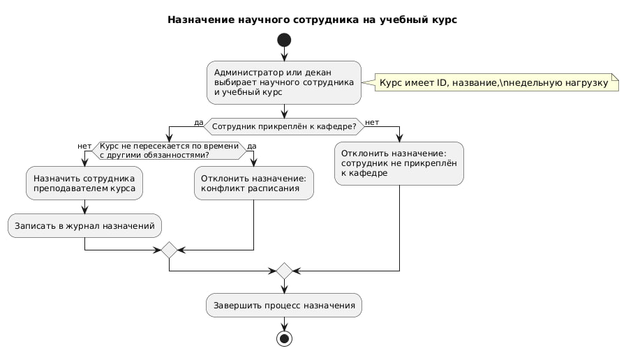

# Лабораторная работа №10: UML-моделирование  
**Тема:** Университетская информационная система  

## Описание
Построена UML-модель информационной системы университета, включающая:
- структуру подразделений (факультеты, кафедры),
- сотрудников (научных и административных),
- проекты, курсы и их взаимосвязи.

## Выполненные шаги
1. Идентификация классов и атрибутов по тексту задания.  
2. Определение отношений между классами.  
3. Добавление методов.  
4. Генерация и запуск кода на объектно-ориентированном языке.  
5. Обратный инжиниринг — получена диаграмма классов по коду.  
6. Созданы поведенческие диаграммы:
   - Диаграмма прецедентов  
   - Диаграммы последовательностей  
   - Диаграмма активностей  

## Файлы проекта
- `lab10.vpp` — основной файл модели в Visual Paradigm  
- `активностей.jpg` — диаграмма активностей
- 
- `последовательностей 2.png` — диаграмма последовательностей
- 
- `претендентов 2.png` — диаграмма прецедентов
- 
